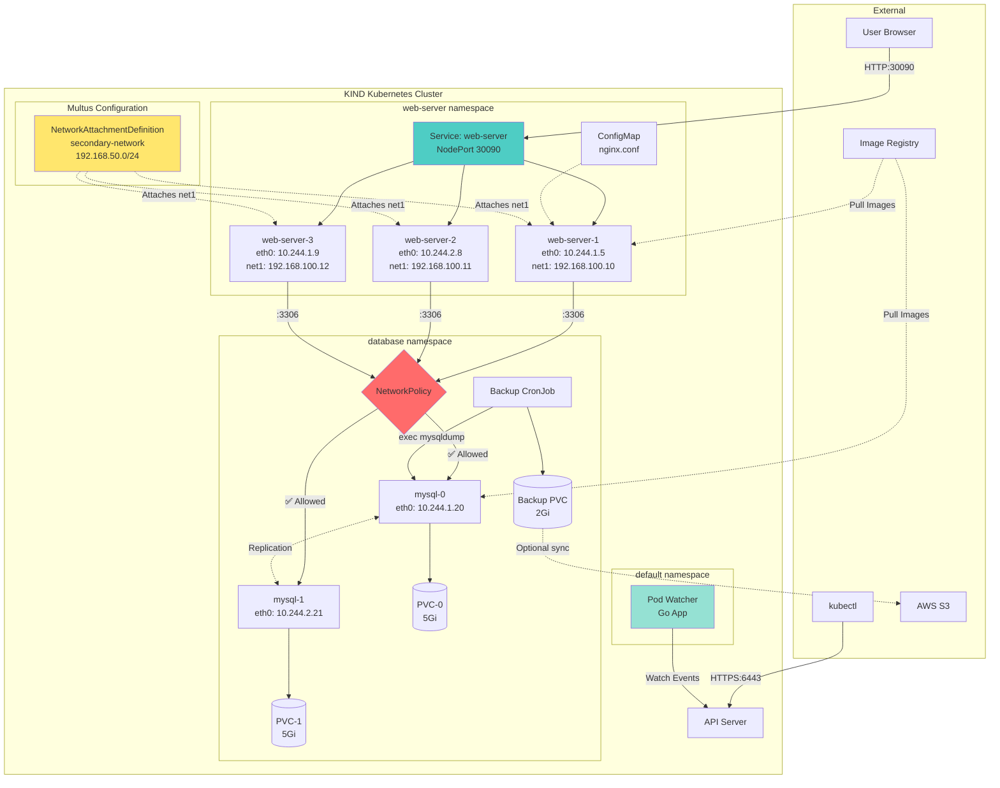

# NG Voice DevOps Case Study

## Table of Contents

- [Overview](#overview)
- [Architecture Design](#architecture-design)
- [Steps to Deploy](#steps-to-deploy)
  - [Prerequisites](#prerequisites)
  - [Step 1: Setup Infrastructure (KIND cluster)](#step-1-setup-infrastructurekind-cluster)
  - [Step 2: Install via Helm](#step-2-install-via-helm)
- [Task-Wise Implementation](#task-wise-implementation)
  - [1. Kubernetes Cluster](#1-kubernetes-cluster)
  - [2. Database with Persistent Data (MySQL)](#2-database-with-persistent-data-mysql)
  - [3. Web Server with Multiple Replicas and Custom Config](#3-web-server-with-multiple-replicas-and-custom-config)
  - [4. Restrict DB Access to Web Pods Only (Port 3306)](#4-restrict-db-access-to-web-pods-only-port-3306)
  - [5. Disaster Recovery (DR)](#5-disaster-recovery-dr)
  - [6. Multi Networking](#6-multi-networking)
  - [7. Scheduling Specific DB Replicas to Nodes](#7-scheduling-specific-db-replicas-to-nodes)
- [Golang Pod Watcher](#golang-pod-watcher)
- [Validation](#validation)
- [Deliverables](#deliverables)

## Overview

This repository implements the case study requirements end to end on Kubernetes:

- Persistent MySQL/MariaDB database
- Multi-replica web server with custom configuration and init-time content mutation
- Enforced network isolation to the database
- Disaster recovery strategy with backup and restore verification, scheduling strategies for database replicas
- Small Golang application to monitor pod lifecycle events. All components are deployable via Helm.

# Architecture Design



## Steps to Deploy

### Prerequisites

- `Docker`, `kind` and `kubectl`.
- `helm` v3 installed.

### Step 1: Setup Infrastructure(KIND cluster)

Create a kind cluster with one control-plane and two worker nodes, with node labels for database scheduling:

```sh
kind create cluster --config ./infrastructure/local/kind/cluster-config.yaml

# Install CNI plugins on the node, this is required for multi-networking support
sh ./infrastructure/local/kind/install-cni-nodes.sh

```

This labels both worker nodes with `db-node=node-1` and `db-node=node-2`, allowing the MySQL `StatefulSet` to schedule pods based on the `nodeAffinity` rules defined in the chart.

### Step 2: Install via Helm

From the Helm chart directory (replace `.` if needed):

```sh
helm install ng-voice ./helm-charts/ng-voice -n default
```

To customize replicas, resources, and configuration:

```sh
helm upgrade --install ng-voice ./helm-charts/ng-voice -n default -f values.yaml
```

Uninstall:

```sh
helm uninstall ng-voice -n default
```

Browser access (example using NodePort or port-forward):

```sh
kubectl -n web-server port-forward svc/web-server 8080:80
# Open http://localhost:8080
```

## Task-Wise Implementation

### 1. Kubernetes Cluster

- Local deployment supported via kind.

> kind (Kubernetes IN Docker) is a tool for running local Kubernetes clusters using Docker container nodes. More info at the [kind official website](https://kind.sigs.k8s.io/).

### 2. Database with Persistent Data (MySQL)

> Requirement: Deploy a DB cluster on K8s with persistant data (MySQL or MariaDB).

- Implemented as a `StatefulSet` with 2 replicas in the `database` namespace.
- Persistent storage via `PersistentVolumeClaim` (5Gi per pod) bound to each pod (`mysql-0`, `mysql-1`).

### 3. Web Server with Multiple Replicas and Custom Config

> Requirement: Deploy a Web Server on K8s (Nginx, Apache, …)

- Deployed as a `Deployment` with 3 replicas (configurable).
- Custom nginx configuration mounted via `ConfigMap`.
- NodePort Service (default: 30090) with sessionAffinity disabled for proper load balancing.
- Web page content includes:
  - `serving-host` field set by an initContainer to `Host-{last 5 chars of pod name}` using `HOSTNAME` and string manipulation.
  - Custom nginx configuration that injects an `X-Served-By: $hostname` HTTP response header to identify which replica served the request.

### 4. Restrict DB Access to Web Pods Only (Port 3306)

> Requirement: Suggest and implement a way to only allows the web server pods to initiate connections to the database pods on the correct port (e.g., 3306 for MySQL). All other traffic to the database should be denied.

Enforced with a `NetworkPolicy` in the `database` namespace:

<details>
<summary>NetworkPolicy YAML</summary>

```yaml
apiVersion: networking.k8s.io/v1
kind: NetworkPolicy
metadata:
  name: db-allow-web-only
  namespace: database
spec:
  podSelector:
    matchLabels:
      app: mysql   # apply to DB pods
  policyTypes:
  - Ingress
  ingress:
  - from:
    - namespaceSelector:
        matchLabels:
          kubernetes.io/metadata.name: web-server
      podSelector:
        matchLabels:
          app: web-server   # only web pods allowed
    - podSelector:
        matchLabels:
          app: mysql-backup
    ports:
    - protocol: TCP
      port: 3306
```

</details>

All other ingress traffic to MySQL is denied.

### 5. Disaster Recovery (DR)

> Requirement: Suggest and implement Disaster recovery solution for the DB.

- Backups: Scheduled CronJobs dump MySQL databases to a backup PVC. Optional S3 sync job for off-cluster copies.
- Restores: Verified using an ephemeral debug pod mounting the backup PVC and streaming dumps back into MySQL.

#### DR Verification Steps

1. Use a debug pod to inspect backup PVC contents.
2. Copy backup locally.
3. Restore to MySQL.

Optional off-cluster backups to S3 can be enabled via a CronJob that syncs `/backup` to an S3 bucket using credentials provided as Kubernetes `Secret`s.

### 6. Multi Networking

> Requirement: Find and implement if possible a flexible way to connect the Pod to a new network other than the Pods networks with proper routes. no LoadBalancer service is needed.

- Implemented using Multus CNI to attach an additional network interface to the `web-server` pods.
- Used a simple bridge network for demonstration.

> Improvement Note: Current helm chart setup is not handling the CRDs installation properly. After Multus DeamonSet is up and running, we have to manually once restart the web-server deployment to pickup the network attachment definition.

### 7. Scheduling Specific DB Replicas to Nodes

> Requirement: Find and implement if possible a flexible a way to allow the deployment engineer to schedule specific replicas of the database cluster on specific k8s nodes. For example: saying db-x and db-y are pods of the same cluster

What is implemented:

- Label nodes with required KV pair. In our case we have used `db-node=node-1`, `db-node=node-2`.
- Use `nodeAffinity` to schedule specific DB replicas to nodes based on these labels.
- Use `podAntiAffinity` to avoid co-scheduling DB pods on the same node.
- The labels are configurable via Helm values.

## Golang Pod Watcher

- Monitors pods with the project label `project=ng-voice` and logs events for Added/Modified/Deleted.
- Supports in-cluster execution and out-of-cluster via kubeconfig.
- Deployment via Helm alongside other components.

Run locally (example):

```sh
go run ./applications/go-controller/main.go
```

Detailed code structure and functions are documented [here](./applications/go-controller/README.md).

## Validation

- Load balancing: As this setup uses NodePort Service, try opening the web server in different browser tabs or via curl to see responses from different pods.
- NetworkPolicy: Launch test pods across namespaces; verify only `web-server` pods with `access=mysql-client` label can connect to `mysql.database:3306`.
- DR: Follow the verification steps above to confirm backup creation and successful restore.

## Deliverables

1. Design of the internal and external connections, [here](#architecture-design)
2. Helm-charts, [here](./helm-charts/ng-voice)
3. Source code Golang Applications, [here](./applications/go-controller)
4. Dockerfiles, [here](./Dockerfiles)
5. Access to the cluster preferably or a working demo: as we have used KIND cluster, steps are provided to recreate the entire setup locally.

## TODO:
1. Helm chart can be hosted in a chart repository for easier consumption.
2. CRD installation for Multus needs to be fixed.
3. Terraform EKS setup is not functional yet, need to fix and test it.
